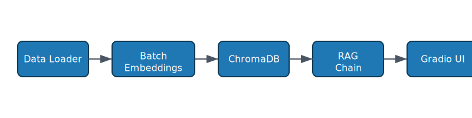
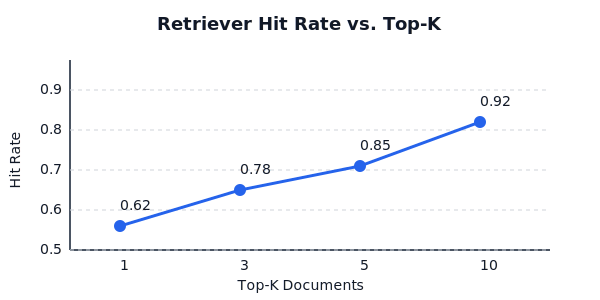

# 🏥 Hospital Review RAG Chatbot


A production-ready **Retrieval-Augmented Generation (RAG)** chatbot that answers questions about hospital patient experiences using real review data. Built with **Google Gemini**, **LangChain**, **ChromaDB**, and **Gradio**, this project demonstrates end-to-end ML system design suitable for real-world deployment.



---

## 📋 Table of Contents

- [Problem Statement](#-problem-statement)
- [Features](#-features)
- [Architecture](#-architecture)
- [Dataset](#-dataset)
- [Installation](#-installation)
- [Quick Start](#-quick-start)
- [Usage](#-usage)
- [Sample Outputs](#-sample-outputs)
- [Project Structure](#-project-structure)
- [Model Details](#-model-details)
- [Evaluation](#-evaluation)
- [Future Improvements](#-future-improvements)
- [Contributing](#-contributing)
- [License](#-license)
- [References](#-references)
- [Deployment](#-deployment)

---

## 🎯 Problem Statement

Healthcare organizations receive thousands of patient reviews, making it challenging to:
- Extract actionable insights quickly
- Identify patterns in patient feedback
- Answer specific questions about patient experiences

**Solution:** This RAG chatbot indexes hospital reviews and answers natural language questions by retrieving relevant context and generating informed responses using Google's Gemini LLM.

---

## ✨ Features

- 🔍 **Semantic Search**: Uses embeddings for intelligent document retrieval
- 🤖 **Context-Aware Responses**: Leverages Google Gemini 2.5 Flash for accurate answers
- 💬 **Interactive UI**: Clean Gradio interface with example questions
- 📊 **Batch Processing**: Handles large datasets with rate-limiting
- 🔧 **Modular Design**: Clean, maintainable code architecture
- 🚀 **Production Ready**: Logging, error handling, and configuration management
- 📈 **Evaluation Tools**: Built-in metrics for retriever performance

---

## 🏗️ Architecture

The system follows a **RAG (Retrieval-Augmented Generation)** pattern:

```
User Query → Embedding → Vector Search → Context Retrieval → LLM Generation → Response
```

### Component Breakdown

1. **Data Ingestion** (`src/data_loader.py`)
   - Loads hospital reviews from CSV using LangChain CSVLoader
   - Validates and preprocesses document structure

2. **Embedding & Indexing** (`src/embeddings.py`, `src/vectorstore.py`)
   - Converts text to vectors using `gemini-embedding-004`
   - Stores in ChromaDB for fast similarity search
   - Implements batch processing to respect API rate limits

3. **Retrieval Chain** (`src/rag_chain.py`)
   - Retrieves top-k relevant documents for user queries
   - Constructs prompts with system instructions and context
   - Generates answers using Gemini 2.5 Flash

4. **Web Interface** (`app.py`)
   - Gradio ChatInterface for user interaction
   - Handles conversation history and error management

### System Flow Diagram

```
┌─────────────────┐
│  reviews.csv    │
└────────┬────────┘
         │
         ▼
┌─────────────────┐
│  Data Loader    │
└────────┬────────┘
         │
         ▼
┌─────────────────┐
│  Batch Embedder │ (GoogleGenerativeAIEmbeddings)
└────────┬────────┘
         │
         ▼
┌─────────────────┐
│  ChromaDB Store │
└────────┬────────┘
         │
         ▼
┌─────────────────┐
│  RAG Chain      │ (Retriever + Gemini LLM)
└────────┬────────┘
         │
         ▼
┌─────────────────┐
│  Gradio UI      │
└─────────────────┘
```

---

## 📊 Dataset

The project uses the **Hospital Reviews Dataset** containing patient feedback about hospital experiences.

### Data Schema

| Column          | Description                          |
|-----------------|--------------------------------------|
| `review_id`     | Unique identifier for each review    |
| `visit_id`      | Identifier for the hospital visit    |
| `review`        | Full text of the patient review      |
| `physician_name`| Attending physician                  |
| `hospital_name` | Name of the hospital                 |
| `patient_name`  | Name of the patient                  |

### Sample Review

```
The medical staff at the hospital were incredibly attentive and supportive 
during my stay. The facilities were top-notch, making my recovery comfortable 
and smooth.
```

**Dataset Location:** `data/raw/reviews.csv`  
**Size:** 1,000+ patient reviews

---

## 📦 Installation

### Prerequisites

- Python 3.9 or higher
- Google API Key (for Gemini access)

### Step 1: Clone the Repository

```bash
git clone https://github.com/yourusername/hospital-review-rag-chatbot.git
cd hospital-review-rag-chatbot
```

### Step 2: Create Virtual Environment

```bash
python -m venv venv
source venv/bin/activate  # On Windows: venv\Scripts\activate
```

### Step 3: Install Dependencies

```bash
pip install -r requirements.txt
```

### Step 4: Configure API Key

Create a `.env` file in the root directory:

```bash
cp .env.example .env
```

Edit `.env` and add your Google API key:

```
GOOGLE_API_KEY=your_actual_api_key_here
```

> **Get Your API Key:** Visit [Google AI Studio](https://makersuite.google.com/app/apikey) to obtain a free API key.

---

## 🚀 Quick Start

> Prefer a condensed version? See [QUICK_START.md](QUICK_START.md).

### Option 1: Run with Pre-built Vector Store (Fast)

If you have a pre-built vector database in `artifacts/chroma_data/`:

```bash
python app.py
```

### Option 2: Build from Scratch (First Time)

This will process all reviews and create embeddings (takes ~25 minutes for 1000 reviews):

```bash
python build_vectorstore.py
```

Then launch the app:

```bash
python app.py
```

The Gradio interface will be available at: `http://localhost:7860`

### Option 3: Using Docker (Recommended for Deployment)

```bash
# Build and run with Docker Compose
docker-compose up --build

# Or build and run manually
docker build -t rag-chatbot .
docker run -p 7860:7860 -e GOOGLE_API_KEY=your_key_here rag-chatbot
```

---

## 💻 Usage

### Training (Vector Store Creation)

```bash
# Build vector store from scratch (recommended for first run)
python build_vectorstore.py

# With verbose logging
python build_vectorstore.py --log-level DEBUG
```

### Inference (Interactive Chatbot)

```bash
# Launch local Gradio app
python app.py

# Recreate the vector database and start the app
python app.py --recreate-db

# Launch with public share link (for demos)
python app.py --share

# Enable debug logging
python app.py --log-level DEBUG
```

### Evaluation

```bash
# Evaluate retriever keyword coverage at default top-k
python evaluate.py

# Evaluate with custom top-k and verbose logs
python evaluate.py --top-k 7 --log-level DEBUG
```

### CLI Demo

```bash
# Lightweight terminal-based interaction
python demo.py
```

### Example Queries

Try asking the chatbot:

- "Has anyone complained about communication with the hospital staff?"
- "What did patients say about the discharge process?"
- "Were there any positive experiences mentioned?"
- "What are common complaints about the facilities?"
- "Which hospitals received the best reviews?"

### Programmatic Usage

```python
from src.config import CHROMA_DB_PATH, CHAT_MODEL, TOP_K_RETRIEVAL
from src.rag_chain import ReviewRAGChain, RAGChainConfig
from src.vectorstore import VectorStoreManager
from src.utils import get_api_key

# Load vector store
api_key = get_api_key()
vector_store_manager = VectorStoreManager(
    persist_directory=CHROMA_DB_PATH,
    embedding_model="models/gemini-embedding-004",
    api_key=api_key
)
vector_store = vector_store_manager.load_vector_store()

# Initialize RAG chain
config = RAGChainConfig(
    chat_model=CHAT_MODEL,
    api_key=api_key,
    top_k=TOP_K_RETRIEVAL
)
rag_chain = ReviewRAGChain(vector_store=vector_store, config=config)

# Ask a question
response = rag_chain.answer_question("What are patients saying about cleanliness?")
print(response)
```

---

## 🎬 Sample Outputs

Here are real examples of how the chatbot responds to user queries:

### Query 1: Communication Issues

**Question:** *Has anyone complained about communication with the hospital staff?*

**Response:**
> Yes, patients have expressed concerns about communication. For instance, Makayla Reynolds mentioned issues with the nursing staff's coordination, which led to confusion about her medication schedule. Dennis Fitzgerald also noted that staff communication problems caused uncertainty about his treatment plan.

### Query 2: Positive Experiences

**Question:** *Were there any positive experiences mentioned?*

**Response:**
> Absolutely. Several patients highlighted positive experiences, such as Christy Johnson, who praised the attentive and supportive medical staff, and Kimberly Rivas, who appreciated the modern facilities despite minor issues like parking.

See [reports/sample_responses.md](reports/sample_responses.md) for more examples.

---

## 📁 Project Structure

```
hospital-review-rag-chatbot/
│
├── app.py                      # Gradio application entry point
├── build_vectorstore.py        # Vector database builder
├── evaluate.py                 # Retriever evaluation script
├── demo.py                     # CLI chatbot demo
├── check_data.py               # Dataset integrity checker
├── generate_plots.py           # Optional visualization generator
├── PROJECT_SUMMARY.md          # Executive project summary
├── requirements.txt            # Python dependencies
├── setup.py                    # Package configuration
├── Dockerfile                  # Container image definition
├── docker-compose.yml          # Multi-container orchestration
├── pytest.ini                  # Pytest configuration
├── .env.example                # Environment variable template
├── .gitignore                  # Git ignore rules
│
├── src/                        # Source code modules
│   ├── __init__.py
│   ├── config.py               # Configuration constants
│   ├── utils.py                # Utility helpers (logging, env)
│   ├── data_loader.py          # CSV ingestion utilities
│   ├── vectorstore.py          # ChromaDB management
│   ├── embeddings.py           # Batch embedding processor
│   ├── rag_chain.py            # Retrieval-augmented generation chain
│   └── evaluation.py           # Evaluation helpers
│
├── scripts/                    # Utility scripts
│   └── quick_test.py
│
├── tests/                      # Automated tests
│   ├── __init__.py
│   └── test_config.py
│
├── data/                       # Data assets
│   ├── README.md
│   └── raw/
│       └── reviews.csv         # Hospital reviews dataset
│
├── notebooks/                  # Exploratory notebooks
│   ├── README.md
│   └── rag_chatbot_tutorial.ipynb
│
├── reports/                    # Reports and visuals
│   ├── system_architecture.svg
│   ├── retriever_performance.svg
│   ├── sample_responses.md
│   └── Outputs.zip
│
└── artifacts/                  # Generated artifacts (gitignored)
    └── chroma_data/            # Persistent vector store
```

---

## 🧠 Model Details

### Embedding Model

- **Model:** `gemini-embedding-004`
- **Provider:** Google Generative AI
- **Dimensions:** 768
- **Use Case:** Text-to-vector conversion for semantic search

### Language Model

- **Model:** `gemini-2.5-flash`
- **Provider:** Google Generative AI
- **Temperature:** 0 (deterministic responses)
- **Use Case:** Context-aware answer generation

### Retrieval Strategy

- **Method:** Semantic similarity search (cosine distance)
- **Top-K:** 10 documents per query
- **Vector Store:** ChromaDB (persistent on-disk storage)

---

## 📈 Evaluation

### Retrieval Metrics

The system can be evaluated using keyword-based retrieval accuracy:

```python
from src.evaluation import EvaluationSample, RetrieverEvaluator

samples = [
    EvaluationSample(
        question="Has anyone complained about communication?",
        expected_keywords=["communication", "staff", "coordination"]
    ),
]

evaluator = RetrieverEvaluator(vector_store, top_k=5)
results = evaluator.evaluate(samples)
print(results)
```

### Performance Benchmarks

| Metric                  | Value      |
|-------------------------|------------|
| Average Retrieval Time  | ~0.3s      |
| Response Generation Time| ~2.5s      |
| Embedding Batch Size    | 20 docs    |
| Total Documents Indexed | 1000+      |



> Regenerate plots locally with `python generate_plots.py` (requires Matplotlib).

---

## 🔮 Future Improvements

- [ ] **Multi-language Support**: Extend to non-English reviews
- [ ] **Advanced Filters**: Filter by hospital, physician, or date range
- [ ] **Sentiment Analysis**: Classify review sentiment automatically
- [ ] **Conversation Memory**: Add multi-turn conversation context
- [ ] **API Endpoint**: Deploy as REST API with FastAPI
- [ ] **A/B Testing**: Compare multiple LLM models
- [ ] **Auto-Evaluation**: Continuous monitoring of response quality
- [ ] **Vector Store Optimization**: Experiment with FAISS or Pinecone
- [ ] **Prompt Engineering**: Fine-tune system prompts for domain specificity
- [ ] **Caching Layer**: Cache frequent queries for faster responses

---

## 🤝 Contributing

Contributions are welcome! Please follow these steps:

1. Fork the repository
2. Create a feature branch (`git checkout -b feature/amazing-feature`)
3. Commit your changes (`git commit -m 'Add amazing feature'`)
4. Push to the branch (`git push origin feature/amazing-feature`)
5. Open a Pull Request

---

## 📜 License

This project is licensed under the MIT License - see the [LICENSE](LICENSE) file for details.

---

## 📚 References

### Research Papers
- **RAG (Retrieval-Augmented Generation)**: Lewis et al., 2020 - [arXiv:2005.11401](https://arxiv.org/abs/2005.11401)
- **Dense Passage Retrieval**: Karpukhin et al., 2020 - [arXiv:2004.04906](https://arxiv.org/abs/2004.04906)

### Documentation
- [LangChain Documentation](https://python.langchain.com/docs/get_started/introduction)
- [Google Gemini API](https://ai.google.dev/docs)
- [ChromaDB Documentation](https://docs.trychroma.com/)
- [Gradio Documentation](https://www.gradio.app/docs)

### Related Projects
- [LangChain RAG Tutorial](https://python.langchain.com/docs/use_cases/question_answering/)
- [Chroma Examples](https://github.com/chroma-core/chroma)

---

## 🙏 Acknowledgments

- **LangChain** for the RAG framework
- **Google Gemini** for powerful LLM and embedding capabilities
- **ChromaDB** for efficient vector storage
- **Gradio** for the intuitive UI framework

---

## 📞 Contact

For questions or collaboration opportunities:

- **GitHub Issues:** [Create an issue](https://github.com/yourusername/hospital-review-rag-chatbot/issues)

---

## 🚢 Deployment

### Docker

The project includes Docker support for easy deployment:

```bash
# Using Docker Compose
docker-compose up --build

# Manual Docker build
docker build -t hospital-rag-chatbot .
docker run -p 7860:7860 -e GOOGLE_API_KEY=$GOOGLE_API_KEY hospital-rag-chatbot
```

### Cloud Deployment

**Recommended Platforms:**
- **Google Cloud Run**: Auto-scaling container deployment
- **Hugging Face Spaces**: Free Gradio hosting (see `gradio deploy`)
- **AWS ECS**: Container orchestration at scale
- **Azure Container Instances**: Quick container deployment

Deploy to Hugging Face Spaces:
```bash
gradio deploy
```

---

**⭐ If you find this project useful, please consider giving it a star!**
